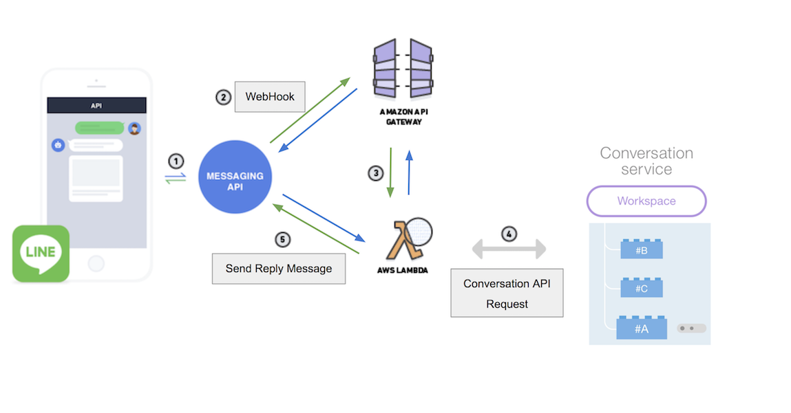

# Line-Chatbot

   Line Message API, Watson Converation API를 이용한 Chatbot Prototype 개발

## Features

### FLOW

### Platform && SDK

>*AWS Gateway API*

>*AWS Lambda*

>*line / line-bot-sdk-python*

>*Line Message API*

>*watson-developer-cloud / python-sdk*

>*Watson Conversation API*

 

## Reference

> [Lambda Doc](http://docs.aws.amazon.com/lambda/latest/dg/lambda-introduction-function.html)

> [Line API](https://developers.line.me/en/docs/messaging-api/reference)

> [line / line-bot-sdk-python](https://github.com/line/line-bot-sdk-python)

> [Watson Conversation API](https://www.ibm.com/watson/developercloud/conversation/api/v1/?python#list_workspaces)

> [watson-developer-cloud / python-sdk](https://github.com/watson-developer-cloud/python-sdk)

> [IBM Bluemix Docs](https://console.bluemix.net/docs/services/conversation/index.html#about)

## System dependencies

    * Python 3.6
    * Line SDK
    * Watson Cloud SDK
    
